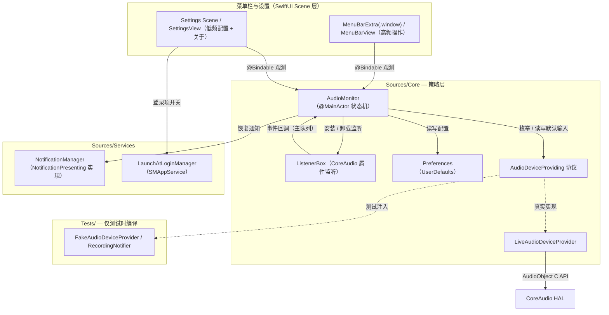
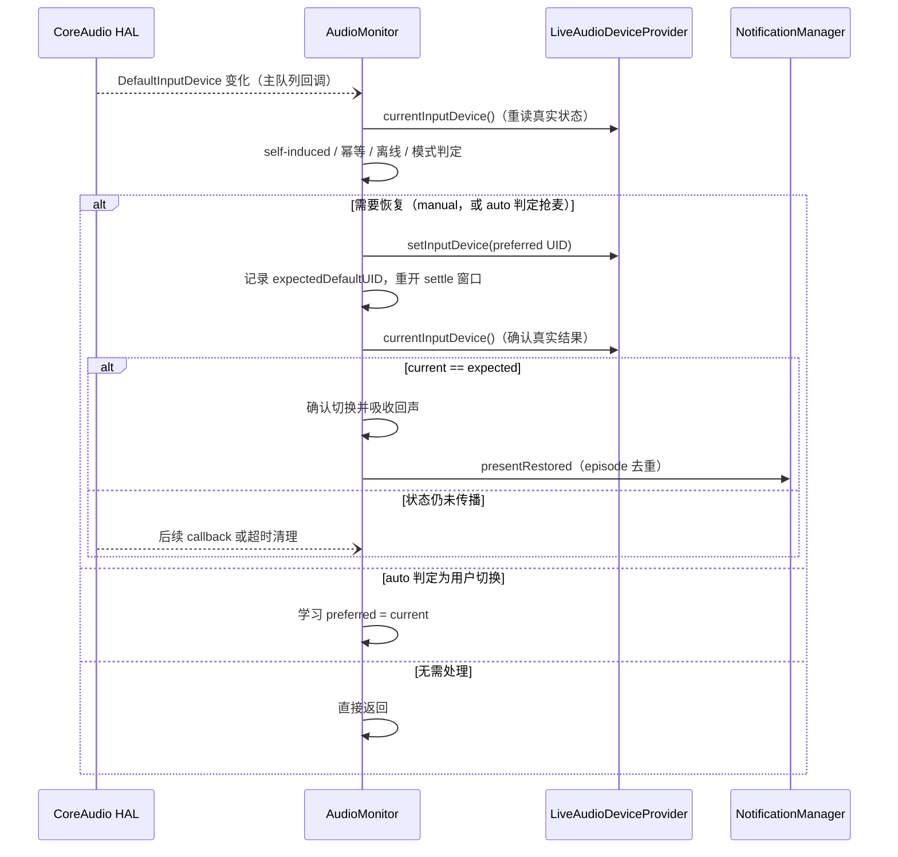

# MicLock 架构与实现

MicLock 只做一件事：守住系统默认输入设备（CoreAudio 的 `kAudioHardwarePropertyDefaultInputDevice`），不让新接入的设备悄悄抢占。本文介绍模块结构、事件流、恢复路径、通知、登录项、配置、调试与测试；Auto 模式的判定细节见 [auto-mode.md](auto-mode.md)。

## 设计原则

- **事件驱动**：所有决策由 CoreAudio 属性监听回调触发，无轮询、无定时 enforce。工程只有 settle 窗口、程序化切换确认超时和设置窗口展示诊断三类短时任务（见 [auto-mode.md](auto-mode.md)）
- **分层可测**：CoreAudio 访问封装在 `AudioDeviceProviding` 协议后面，策略层（AudioMonitor）只依赖协议；单元测试注入内存 Fake
- **单写入口**：所有恢复统一走 `restorePreferred(from:to:reason:)`，唯一的写入目标始终是 `DefaultInputDevice`，绝不触碰任何输出设备
- **零依赖**：仅使用系统框架（SwiftUI / AppKit / CoreAudio / UserNotifications / ServiceManagement / OSLog / Observation）

## 模块结构



| 文件 | 职责 |
|---|---|
| `Sources/MicLockApp.swift` | SwiftUI App 入口：`MenuBarExtra(.window)`（高频操作，左/右键共用）与 `Settings` Scene 两个 Scene；`MicLockAppDelegate` 负责启动时序、label 状态镜像与右键事件桥接 |
| `Sources/ActivationPolicyManager.swift` | 动态 Activation Policy：平时 `.accessory` 常驻菜单栏，打开普通窗口（Settings）时临时 `.regular`（有 Dock / 顶部 App Menu），demand 全部结束后切回。窗口 identity 与 regular demand 两个正交状态：identity（weak，close 后保留）识别复用的 NSWindow；demand 由用户意图与 `willCloseNotification` 驱动 policy。无基于超时的降级——`openSettings()` 没有 success/failure 回调，窗口物化耗时（实测 ~2–3s）不能推断 Scene 生命周期 |
| `Sources/SettingsView.swift` | 设置窗口：通用（登录项 / 通知）/ 高级（设备稳定窗口）/ 关于（`AboutView`）三个 Tab；`WindowAccessor` bridge 把底层 NSWindow 注册给 ActivationPolicyManager |
| `Sources/AboutView.swift` | 设置窗口「关于」Tab 内容：图标、动态版本/构建号、说明与 GitHub / License 链接 |
| `Sources/Core/AudioMonitor.swift` | 核心状态机：事件处理、模式判定、恢复、通知编排、调试 trace；UI 可见状态以 `@Observable` 暴露，内部状态 `@ObservationIgnored` |
| `Sources/Core/LiveAudioDeviceProvider.swift` | CoreAudio HAL 封装：设备枚举、UID/名称/传输类型查询、默认输入读写 |
| `Sources/Core/AudioDeviceProviding.swift` | CoreAudio 访问抽象协议（测试注入点） |
| `Sources/Core/AudioInputDevice.swift` | 设备模型 |
| `Sources/Core/Preferences.swift` | UserDefaults 封装 |
| `Sources/Core/ProtectionMode.swift` | `auto` / `manual` 枚举与 `RestoreReason` |
| `Sources/Core/NotificationPresenting.swift` | 通知抽象协议（测试注入点） |
| `Sources/Services/NotificationManager.swift` | UserNotifications 授权管理与横幅投递 |
| `Sources/Services/LaunchAtLoginManager.swift` | SMAppService 登录项 |
| `Scripts/select-toolchain.sh` | Swift 工具链发现（系统/用户目录中最新，可用 `MICLOCK_TOOLCHAIN` 覆盖） |
| `Scripts/select-sdk.sh` | 用所选工具链探测可用 macOS SDK（构建与测试共用） |
| `Scripts/genicon.swift` | App 图标生成器（绘制 `Resources/AppIcon.svg` 的同源几何，产出 iconset 后经 `iconutil -c icns` 打包） |
| `Resources/AppIcon.svg` | App 图标设计源（卡通麦克风）；`Resources/AppIcon.icns` 为构建产物 |
| `Resources/MenuBarIconTemplate.svg` | 菜单栏单色 template image，运行时由 macOS 着色 |
| `Tests/` | 单元测试源码与 `run.sh` 测试脚本 |

## 设备标识：UID 而不是 AudioDeviceID

CoreAudio 的 `AudioDeviceID` 是运行时数值，重启或重插后会变；`kAudioDevicePropertyDeviceUID`（如 `BuiltInMicrophoneDevice`）在系统中长期稳定。因此：

- 持久化与协议边界上一律使用 **UID**（`preferredMicrophoneUID`）
- `deviceID` 仅在单次运行的 CoreAudio 操作中解析使用，绝不落盘
- 「内置麦克风」只按 `TransportType == kAudioDeviceTransportTypeBuiltIn` 判断，不按名字猜测

首选设备离线时：保留 UID 等待重连，不学习系统临时 fallback 的设备，菜单显示「⚠ 未连接」。

## 事件流

两个监听都注册在 CoreAudio 系统对象（`kAudioObjectSystemObject`）上，回调投递到主队列，再经 `Task { @MainActor … }` 进入状态机——决策全程在主 actor 串行执行，无需加锁：

| 属性 | 处理 |
|---|---|
| `kAudioHardwarePropertyDevices`（设备拓扑） | `handleDeviceListChanged()`：重新枚举并求差集；有真实 delta 时跟踪未稳定新设备、开 settle 窗口，preferred 重新出现则立即恢复 |
| `kAudioHardwarePropertyDefaultInputDevice`（默认输入） | `handleDefaultInputChanged()`：重读真实状态后进入决策（详见 [auto-mode.md](auto-mode.md)） |

burst 事件（CoreAudio 常在插拔瞬间连发多条）的处理保证幂等：列表事件无 delta 时只刷新当前设备、不重开窗口；默认输入事件未实际变化时直接返回。

**self-induced 回声**：MicLock 自己 set `DefaultInputDevice` 同样会触发监听。恢复前先把 `expectedDefaultUID` 置为 preferred 的 UID，之后只有重新读取到真实 `currentDevice` 命中该值才确认成功；中间 callback 会等待后续状态传播，超时则清理 expected 状态。这是防止 setter 循环和伪造成功状态的关键。



## 启动顺序

1. 读取偏好 → 枚举设备 → 读取当前默认输入（`AudioMonitor.init`）
2. 首次运行且无 preferred：默认选内置麦克风（否则当前设备）
3. App 完成启动后安装监听并执行启动对齐（`start()` → `evaluateStartupPolicy()`）：保护开启且 preferred 在线且 current ≠ preferred → 恢复（不通知）
4. 启动约 0.5 秒后检查（必要时请求）通知授权

授权请求必须放在 App 完成启动之后——App 构造阶段调用 `requestAuthorization` 会被系统静默忽略，弹窗根本不出现。

## 恢复路径（唯一入口）

Manual 抢麦恢复、Auto 抢麦恢复、重连恢复、启动对齐全部走 `restorePreferred(from:to:reason:)`：

1. 置 `expectedDefaultUID = preferred.uid`，并安排确认超时（吸收即将到来的回声）
2. `provider.setInputDevice(preferred.uid)`——全工程唯一的写入口，只写 `DefaultInputDevice`
3. 失败：清除回声标记与挂起通知、记录 `lastError`，结束
4. 成功：重新读取真实 `currentDevice`；若已达到目标则确认，否则等待 listener callback → **重开 settle 窗口**（系统/蓝牙栈常在被打回后立刻反抢，窗口内继续立即恢复直到收敛）→ 仅在确认后投递通知（episode 去重）

`RestoreReason`：`manualLock`（Manual 恢复）/ `automaticHijack`（Auto 判定抢麦）/ `preferredReconnected`（重连恢复）/ `startup`（启动对齐，不发通知）。

## 通知

**授权**：`NotificationManager.ensureAuthorization()` 先读 `UNUserNotificationCenter.notificationSettings()`；`notDetermined` 才调 `requestAuthorization`（此时请求才会真正弹窗）；被拒时设置窗口（通用 → 通知）显示提示行并可一键跳转系统设置。请求时机：启动后 0.5s、或用户重新打开「显示通知」开关时。

**投递**：按 `RestoreReason` 生成标题，正文 `旧设备 → 新设备`，无声音；App 处于前台时仍显示横幅（`willPresent` 返回 `.banner`——菜单栏应用没有前台窗口概念，不设此项横幅会被吞掉）。

**去重**：Auto 模式下一次设备拓扑变化 = 一个 Protection Episode，从窗口开启到 settle 到期，整个 episode 最多投递一条通知（蓝牙栈反抢 2-3 次很常见）；Manual 模式没有 episode 限制，每次外部切换→恢复都通知；启动对齐从不通知。

## 登录时启动（SMAppService）

- 使用 `SMAppService.mainApp`（macOS 13+），不写 LaunchAgent plist、不改 `~/Library/LaunchAgents`；状态以系统为唯一事实来源，本地不持久化
- 要求 App 位于稳定路径（`~/Applications` 或 `/Applications`）——从临时构建目录 `open` 的 .app 注册会被系统拒绝
- 已知特性：`register()` / `unregister()` 成功返回后 `status` 仍会滞后数秒（底层 BTM 数据库异步落盘）。Toggle 通过显式 `Binding` 只在用户操作时调用服务写入；`onAppear` 与延迟复核只同步本地状态，不会再次触发 `register()` / `unregister()`。采用乐观更新 + 3 秒内轮询复核（每 0.75s 一次，共 4 次；`requiresApproval` 状态保持勾选并等用户在系统设置批准）；写入失败或状态未收敛时在“设置 → 通用 → 启动”就地显示错误

## 配置

UserDefaults（`lee.miclock.app` 域）：

| 键 | 含义 |
|---|---|
| `preferredMicrophoneUID` | 首选麦克风 Device UID |
| `protectionEnabled` | 是否启用保护 |
| `protectionMode` | `auto` / `manual`（未知值读作 manual） |
| `notificationsEnabled` | 恢复时是否显示通知（默认开） |
| `settleSeconds` | 设备稳定窗口，1–30s（默认 2） |

全新安装默认：Auto 模式、保护关闭、通知开、settle 2s——首次打开菜单由用户自行开启保护。

## 调试

- `MICLOCK_DEBUG=1`：关键决策流（事件、判定、恢复）镜像输出到 stderr，配合直接运行二进制使用
- `MICLOCK_TRACE_PATH=/path/to/log`：决策流追加写入文件。对 `open` 启动的 GUI 实例需经环境注入：

  ```zsh
  launchctl setenv MICLOCK_TRACE_PATH /tmp/miclock-trace.log
  open build/MicLock.app
  launchctl unsetenv MICLOCK_TRACE_PATH
  ```

- OSLog 统一日志（subsystem = `lee.miclock.app`，category 按模块）。注意部分环境下 `log show` 读不到统一日志，trace 文件是更可靠的决策记录

### OSLog 日志构造约束

`Logger` 的结构化日志参数是 `OSLogMessage`，不是普通 `String`。包含 `privacy` 标注的消息必须写成一个完整的插值字面量：

```swift
Self.logger.info(
    "RESTORE_CONFIRMED \(current.name, privacy: .public) → \(preferred.name, privacy: .public)"
)
```

不要用 `+` 拼接多个结构化日志片段：

```swift
Self.logger.info(
    "RESTORE_CONFIRMED \(current.name, privacy: .public) → " +
    "\(preferred.name, privacy: .public)"
)
```

保持单个插值字面量既能通过 Swift 6 编译，也能保留统一日志的格式和隐私元数据。此约束只适用于 `Logger` 的结构化消息；`trace(_:)` 接收普通 `String`，可以正常使用字符串运算。

## 单元测试

```zsh
./Tests/run.sh
```

与 App 相同的 Core/Services 源一起编译（不含 `@main` 入口），注入 `FakeAudioDeviceProvider`（内存设备表 + 可控 setter 失败/延迟状态 + 调用记录）与 `RecordingNotifier`（通知计数），直接调用 `handleDefaultInputChanged()` / `handleDeviceListChanged()` 模拟 CoreAudio 回调，`UserDefaults` 用随机命名的独立 suite 隔离。当前 22 个用例 / 71 个断言：

| 场景 | 断言要点 |
|---|---|
| M1–M3（Manual） | 外部切换立即恢复、preferred 离线不动、MicLock 内选择立即生效且回调不误判 |
| 状态确认回归 | setter 失败不覆盖 preferred、异步状态未确认前不通知、中间 callback 不重复 setter |
| A1–A4（Auto） | 接入抢麦立即恢复、稳定后切换被学习、窗口内切换按启发式恢复、新设备稳定后接受 |
| burst | 交错重复事件下 setter 不循环、一 episode 一条通知 |
| 重连 | preferred 断开保留 UID、同 UID 复现自动恢复、系统已自动恢复时不重复 setter |
| 窗口内 Trusted 选择 | 立即生效且不被回声恢复 |
| 保护关闭 / 启动对齐 / 幂等 / 首次运行 / 钳制 | 各边界行为 |

## 隐私与安全约束

无网络访问、无 telemetry、无自动更新、无第三方依赖、无 shell 执行、无 AppleScript、无 Accessibility、无 root/sudo、无录音（不申请麦克风权限）。唯一写入的 CoreAudio 属性是 `kAudioHardwarePropertyDefaultInputDevice`，绝不触碰输出设备。
