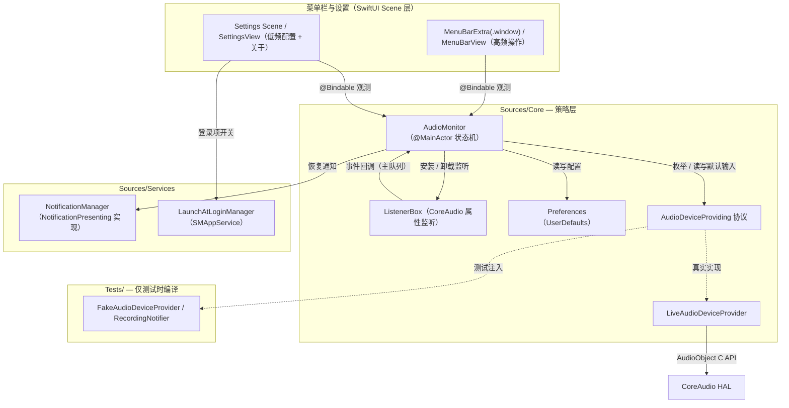
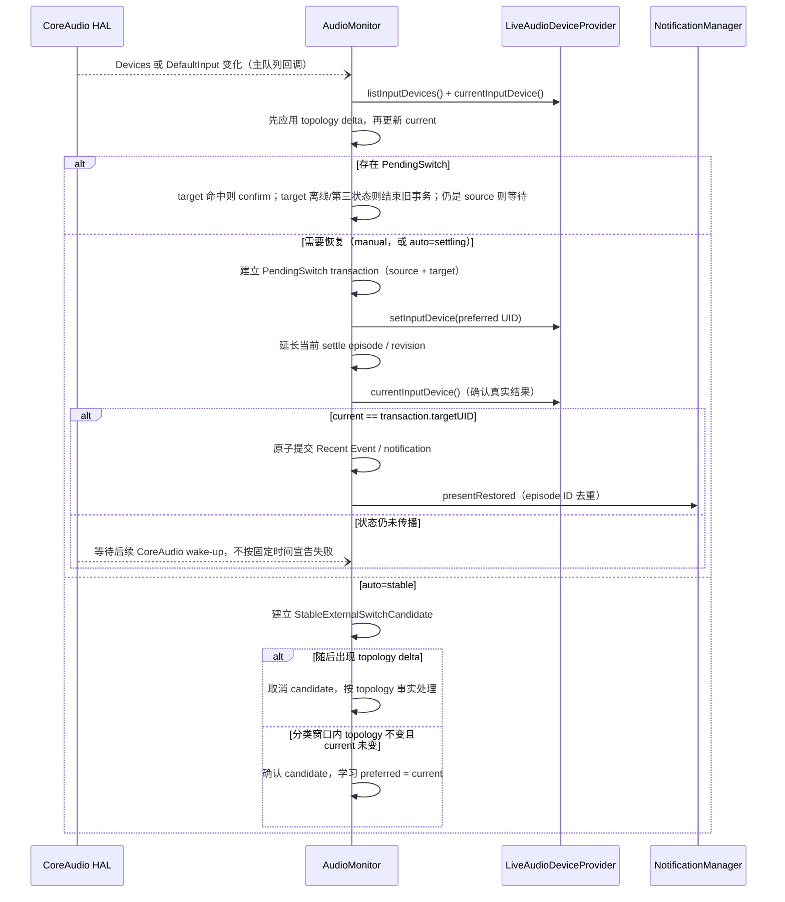

# MicLock 架构与实现

MicLock 只做一件事：守住系统默认输入设备（CoreAudio 的 `kAudioHardwarePropertyDefaultInputDevice`），不让新接入的设备悄悄抢占。本文介绍模块结构、事件流、恢复路径、通知、登录项、配置、调试与测试；Auto 模式的判定细节见 [auto-mode.md](auto-mode.md)。

## 设计原则

- **事件驱动**：CoreAudio 决策没有轮询和周期性 enforce。工程仅在有限生命周期场景使用 Task，例如 settle 窗口、程序化切换确认、Settings 展示诊断、通知授权延迟以及系统服务状态收敛复核（见 [auto-mode.md](auto-mode.md)）
- **分层可测**：CoreAudio 访问封装在 `AudioDeviceProviding` 协议后面，策略层（AudioMonitor）只依赖协议；单元测试注入内存 Fake
- **单写入口**：所有恢复统一走 `restorePreferred(from:to:reason:)`，唯一的写入目标始终是 `DefaultInputDevice`，绝不触碰任何输出设备
- **零依赖**：仅使用系统框架（SwiftUI / AppKit / CoreAudio / UserNotifications / ServiceManagement / OSLog / Observation）

## 模块结构



| 文件 | 职责 |
|---|---|
| `Sources/MicLockApp.swift` | SwiftUI App 入口：`MenuBarExtra(.window)`（高频操作，左/右键共用）与 `Settings` Scene 两个 Scene；`MicLockAppDelegate` 负责启动时序、label 状态镜像与右键事件桥接 |
| `Sources/ActivationPolicyManager.swift` | 动态 Activation Policy：平时 `.accessory` 常驻菜单栏，打开普通窗口（Settings）时临时 `.regular`（有 Dock / 顶部 App Menu），demand 全部结束后切回。窗口 identity 与 regular demand 两个正交状态：identity（weak，close 后保留）识别复用的 NSWindow；demand 由用户意图与 `willCloseNotification` 驱动 policy。无基于超时的降级——`openSettings()` 没有 success/failure 回调，窗口物化耗时（实测 ~2–3s）不能推断 Scene 生命周期 |
| `Sources/SettingsView.swift` | 设置窗口：通用（登录项 / 通知）/ 高级（设备稳定窗口）/ 关于（`AboutView`）三个 Tab；`WindowAccessor` bridge 把底层 NSWindow 注册给 ActivationPolicyManager |
| `Sources/AboutView.swift` | 设置窗口「关于」Tab 内容：图标、动态版本/构建号、说明与 GitHub / License 链接 |
| `Sources/Core/AudioMonitor.swift` | 核心策略协调器：事件处理、Auto 稳定性状态机、程序化切换事务、恢复、Recent Events、通知编排与调试 trace；UI 可见状态以 `@Observable` 暴露，内部状态 `@ObservationIgnored` |
| `Sources/Core/LiveAudioDeviceProvider.swift` | CoreAudio HAL 封装：设备枚举、UID/名称/传输类型查询、默认输入读写 |
| `Sources/Core/AudioDeviceProviding.swift` | CoreAudio 访问抽象协议（测试注入点） |
| `Sources/Core/AudioInputDevice.swift` | 设备模型 |
| `Sources/Core/Preferences.swift` | UserDefaults 封装 |
| `Sources/Core/ProtectionMode.swift` | `auto` / `manual`、`RestoreReason` 与 `RecentAudioEvent` 模型及展示文案 |
| `Sources/Core/NotificationPresenting.swift` | 通知抽象协议（测试注入点） |
| `Sources/Services/NotificationManager.swift` | UserNotifications 授权管理与横幅投递 |
| `Sources/Services/LaunchAtLoginManager.swift` | SMAppService 登录项 |
| `Scripts/select-toolchain.sh` | Swift 工具链发现（系统/用户目录中最新，可用 `MICLOCK_TOOLCHAIN` 覆盖） |
| `Scripts/select-sdk.sh` | 用所选工具链探测可用 macOS SDK（构建与测试共用） |
| `Scripts/genicon.swift` | App 图标生成器（绘制 `Resources/AppIcon.svg` 的同源几何，产出 iconset 后经 `iconutil -c icns` 打包） |
| `Resources/AppIcon.svg` | App 图标设计源（卡通麦克风）；`Resources/AppIcon.icns` 为构建产物 |
| `Resources/MenuBarIconTemplate.svg` | 菜单栏单色 template image，运行时由 macOS 着色 |
| `Tests/` | 单元测试源码与 `run.sh` 测试脚本 |

## 设备标识：UID 而不是 AudioDeviceID

CoreAudio 的 `AudioDeviceID` 是运行时数值，重启或重插后会变；`kAudioDevicePropertyDeviceUID`（如 `BuiltInMicrophoneDevice`）在系统中长期稳定。因此：

- 持久化与协议边界上一律使用 **UID**（`preferredMicrophoneUID`）
- `deviceID` 仅在单次运行的 CoreAudio 操作中解析使用，绝不落盘
- 「内置麦克风」只按 `TransportType == kAudioDeviceTransportTypeBuiltIn` 判断，不按名字猜测

首选设备离线时：保留 UID 等待重连，不学习系统临时 fallback 的设备，菜单显示「⚠ 未连接」。

## 事件流

两个监听都注册在 CoreAudio 系统对象（`kAudioObjectSystemObject`）上，回调投递到主队列，再经 `Task { @MainActor … }` 进入状态机——决策全程在主 actor 串行执行，无需加锁：

| 属性 | 处理 |
|---|---|
| `kAudioHardwarePropertyDevices`（设备拓扑） | `handleDeviceListChanged()`：只作为 wake-up，进入统一 `reconcileCoreAudioState()` |
| `kAudioHardwarePropertyDefaultInputDevice`（默认输入） | `handleDefaultInputChanged()`：只作为 wake-up，进入统一 `reconcileCoreAudioState()` |

每次 reconcile 都重新读取默认输入并尝试枚举设备列表，但这不是 HAL 提供的原子 snapshot：DefaultInput 与 Devices 两个属性本身仍可能分阶段收敛。只有设备枚举成功时才更新 `devices / connectedUIDs` 并运行 topology/policy；枚举失败时保留上一份有效 topology，只更新可独立读取的 `currentDevice`。burst / 重复 callback 通过差集与状态机保持幂等。

**stable external switch candidate**：Auto + stable 下的外部 default 变化不会立刻覆盖 preferred，而是建立一个短暂 candidate。UI 的 `currentDevice` 立即更新；若随后出现 topology delta，candidate 取消并按 topology 事实处理；只有分类窗口内 topology 不变且 current 仍为 candidate 目标时才学习新的 preferred。它只延迟 preferred 学习，不延迟 corrective restore。

**self-induced 回声**：MicLock 自己 set `DefaultInputDevice` 同样会触发监听。现在用 `ProgrammaticSwitchState.awaitingConfirmation(PendingSwitch)` 原子保存 transaction ID、source UID、目标 UID、待提交 Recent Event 与通知。只有重新读取到真实 `currentDevice.uid == targetUID` 才确认成功；若 `sourceUID != nil` 且 current 仍等于 source 才继续等待；`sourceUID == nil` 时任何实际出现的非 target current 都会 supersede 旧事务并继续 policy。新事务会整体 supersede 旧事务，因此不同操作之间不会出现 source / target / event / notification 串线。

**Auto 稳定性**：`StabilityState` 与程序化切换事务正交存在，仅有 `stable` / `settling(SettleEpisode)` 两态。每个 episode 保存唯一 ID、revision、`lastActivity`、deadline 与通知去重状态；timer 醒来必须同时匹配 episode ID + revision + deadline 才能把状态变成 stable。详见 [auto-mode.md](auto-mode.md)。



## 启动顺序

1. 读取偏好 → 枚举设备 → 读取当前默认输入（`AudioMonitor.init`）
2. 首次运行且无 preferred：默认选内置麦克风（否则当前设备）
3. App 完成启动后安装监听并执行启动对齐（`start()` → `evaluateStartupPolicy()`）：保护开启且 preferred 在线且 current ≠ preferred → 恢复（不通知）
4. 通知已开启时，启动约 0.5 秒后检查（必要时请求）通知授权

授权请求必须放在 App 完成启动之后——App 构造阶段调用 `requestAuthorization` 会被系统静默忽略，弹窗根本不出现。

## 恢复路径（唯一入口）

Manual 抢麦恢复、Auto 抢麦恢复、重连恢复、启动对齐全部走 `restorePreferred(from:to:reason:)`：

1. 创建一笔 `PendingSwitch`，原子保存 transaction ID、source UID、目标 UID、Recent Event draft 与本次通知 draft
2. `provider.setInputDevice(preferred.uid)`——恢复路径统一只写 `DefaultInputDevice`；用户在 MicLock 中主动选择设备时由 `selectDevice(_:)` 发起同类程序化事务
3. setter 立即失败：只失败当前 transaction，记录 `lastError`，不提交成功事件/通知
4. setter 被接受：延长当前 settle episode，重新读取真实 `currentDevice`；若已经达到 target 则确认，否则保持 pending，等待后续有效 topology snapshot
5. 后续 snapshot 中 target 命中则确认；target 离线则明确失败；current 变成 source/target 之外的第三状态则旧事务被 supersede 并重新运行 policy
6. 确认时原子提交 Recent Event，并按创建通知时携带的 episode ID 做去重后投递通知

程序化切换**不使用固定 confirmation timeout**。经过多少秒本身不是失败证据；这避免 HAL 延迟超过任意硬编码阈值时产生伪错误、丢失 Recent Event 或通知。`settleTask` 仍只负责 Auto 稳定窗口；业务事实分别保存在 `StabilityState` 与 `ProgrammaticSwitchState` 中。运行中修改 `settleSeconds` 会以当前 episode 的 `lastActivity` 为基点重算 deadline 并递增 revision。

`RestoreReason`：`manualLock`（Manual 恢复）/ `automaticHijack`（Auto 判定抢麦）/ `preferredReconnected`（重连恢复）/ `startup`（启动对齐，不发通知）。

## 通知

**授权**：`NotificationManager.ensureAuthorization()` 先读 `UNUserNotificationCenter.notificationSettings()`；`notDetermined` 才调 `requestAuthorization`（此时请求才会真正弹窗）；被拒时设置窗口（通用 → 通知）显示提示行并可一键跳转系统设置。请求时机：通知已开启时启动后 0.5s，或用户重新打开「显示通知」开关时。

**投递**：按 `RestoreReason` 生成标题，正文 `旧设备 → 新设备`，无声音；App 处于前台时仍显示横幅（`willPresent` 返回 `.banner`——菜单栏应用没有前台窗口概念，不设此项横幅会被吞掉）。

**去重**：Auto 模式下一次设备拓扑变化 = 一个 `SettleEpisode`。pending notification 会保存创建时的 episode ID；确认时只允许修改同 ID episode 的 `notificationSent`，因此旧事务晚到的 confirmation 不会污染新 episode。只有通知开关仍开启、实际准备投递时才会把 `notificationSent` 置为 true；确认前关闭通知不会消耗该 episode 的去重额度。整个 episode 最多实际投递一条通知；Manual 模式没有 episode 限制；startup 对齐不通知。

## Recent Events

菜单栏最多展示最近 5 条，内存中最多保留最近 10 条。只有已经确认生效的关键动作才写入：MicLock 菜单选择、Auto 在 stable 状态接受的外部切换，以及各类已确认恢复。

程序化切换的事件先作为 `PendingSwitch` 内的 draft 保存，确认 `current.uid == targetUID` 后才构造成 `RecentAudioEvent`，因此 `occurredAt` 表示确认时间。setter 立即失败、目标离线、被更新外部状态 supersede 或被新用户意图取代的动作都不会留下成功事件。Auto 接受外部切换时，事件来源使用旧 preferred，表达的是 policy 从旧 preferred 迁移到新 current 的事实。

## 登录时启动（SMAppService）

- 使用 `SMAppService.mainApp`（macOS 13+），不写 LaunchAgent plist、不改 `~/Library/LaunchAgents`；状态以系统为唯一事实来源，本地不持久化
- 要求 App 位于稳定路径（`~/Applications` 或 `/Applications`）——从临时构建目录 `open` 的 .app 注册会被系统拒绝
- 已知特性：`register()` / `unregister()` 成功返回后 `status` 仍会滞后数秒（底层 BTM 数据库异步落盘）。Toggle 通过显式 `Binding` 只在用户操作时调用服务写入；`onAppear` 与延迟复核只同步本地状态，不会再次触发 `register()` / `unregister()`。采用乐观更新 + 3 秒内轮询复核（每 0.75s 一次，共 4 次；`requiresApproval` 状态保持勾选并等用户在系统设置批准）；写入失败或状态未收敛时在“设置 → 通用 → 启动”就地显示错误

## 配置

UserDefaults（`lee.miclock.app` 域）：

| 键 | 含义 |
|---|---|
| `preferredMicrophoneUID` | 首选麦克风 Device UID |
| `protectionEnabled` | 是否启用保护 |
| `protectionMode` | `auto` / `manual`（未知值读作 manual） |
| `notificationsEnabled` | 恢复时是否显示通知（默认开） |
| `settleSeconds` | 设备稳定窗口，1–30s（默认 2） |

全新安装默认：Auto 模式、保护关闭、通知开、settle 2s——首次打开菜单由用户自行开启保护。

## 调试

- `MICLOCK_DEBUG=1`：关键决策流（事件、判定、恢复）镜像输出到 stderr，配合直接运行二进制使用
- `MICLOCK_TRACE_PATH=/path/to/log`：决策流追加写入文件。对 `open` 启动的 GUI 实例需经环境注入：

  ```zsh
  launchctl setenv MICLOCK_TRACE_PATH /tmp/miclock-trace.log
  open build/MicLock.app
  launchctl unsetenv MICLOCK_TRACE_PATH
  ```

- OSLog 统一日志（subsystem = `lee.miclock.app`，category 按模块）。注意部分环境下 `log show` 读不到统一日志，trace 文件是更可靠的决策记录

### OSLog 日志构造约束

`Logger` 的结构化日志参数是 `OSLogMessage`，不是普通 `String`。包含 `privacy` 标注的消息必须写成一个完整的插值字面量：

```swift
Self.logger.info(
    "RESTORE_CONFIRMED \(current.name, privacy: .public) → \(preferred.name, privacy: .public)"
)
```

不要用 `+` 拼接多个结构化日志片段：

```swift
Self.logger.info(
    "RESTORE_CONFIRMED \(current.name, privacy: .public) → " +
    "\(preferred.name, privacy: .public)"
)
```

保持单个插值字面量既能通过 Swift 6 编译，也能保留统一日志的格式和隐私元数据。此约束只适用于 `Logger` 的结构化消息；`trace(_:)` 接收普通 `String`，可以正常使用字符串运算。

## 单元测试

```zsh
./Tests/run.sh
```

与 App 相同的 Core/Services 源一起编译（不含 `@main` 入口），注入 `FakeAudioDeviceProvider`（内存设备表 + 可控 setter 失败/延迟/枚举失败状态 + 调用记录）与 `RecordingNotifier`（通知计数），直接调用 `handleDefaultInputChanged()` / `handleDeviceListChanged()` 模拟 CoreAudio wake-up，`UserDefaults` 用随机命名的独立 suite 隔离。当前 36 个用例 / 155 个断言：

| 场景 | 断言要点 |
|---|---|
| M1–M3（Manual） | 外部切换立即恢复、preferred 离线不动、MicLock 内选择立即生效且回调不误判 |
| Programmatic transaction | setter 失败不覆盖 preferred、异步确认前不通知/不写 Recent Event、中间 callback 不重复 setter、模式切换原子 supersede、`sourceUID == nil` 的非 target current 能 supersede、超过旧 1s 阈值后的晚确认仍成功 |
| CoreAudio reconcile / A1–A4（Auto） | callback 正序/反序与属性分阶段变化都不会误学 fallback；枚举失败保留上一份有效 topology；新设备抢麦立即恢复、preferred 拔出保留 UID、stable 外部切换经短暂 candidate 后才学习 |
| Recent Events | accepted switch 来源取旧 preferred、失败动作不记录、历史最多十条且最新优先 |
| Stability / notification episode | burst 下 setter 不循环、episode 最多实际发送一条通知、关闭通知的 confirmation 不消耗额度、修改 settleSeconds 后旧 timer 不得提前结束 episode |
| 重连 | preferred 断开保留 UID、同 UID 复现自动恢复、系统已自动恢复时不重复 setter |
| 窗口内 Trusted 选择 | 立即生效且不被回声恢复 |
| 保护关闭 / 启动对齐 / 幂等 / 首次运行 / 钳制 | 各边界行为 |

## 隐私与安全约束

无网络访问、无 telemetry、无自动更新、无第三方依赖、无 shell 执行、无 AppleScript、无 Accessibility、无 root/sudo、无录音（不申请麦克风权限）。唯一写入的 CoreAudio 属性是 `kAudioHardwarePropertyDefaultInputDevice`，绝不触碰输出设备。
