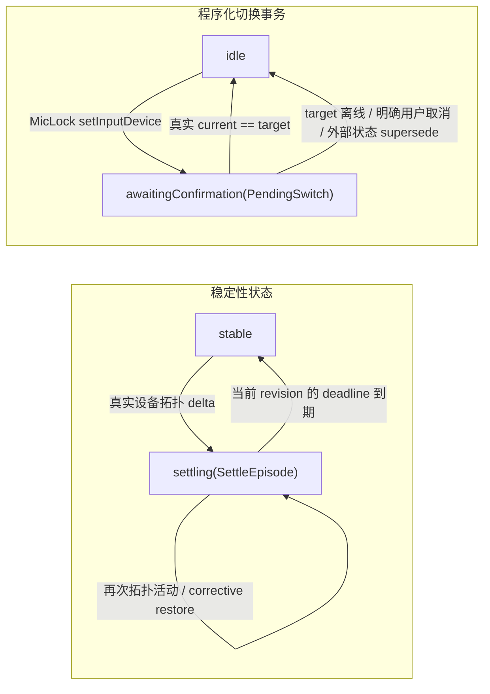
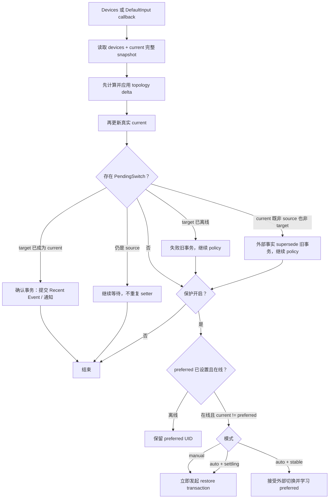

# Auto 模式原理

一句话：**恢复永远是立即的；settle 窗口只用来给变化定性**——判断默认输入变化更像「设备拓扑变化引起的系统抢麦」还是「设备已经稳定后的外部切换」。MicLock 不通过延迟恢复来观察结果，因此不会故意让错误麦克风保持数秒。

## Auto 与 Manual 的差异

| 场景 | Auto | Manual |
|---|---|---|
| 设备接入/断开的稳定窗口内的外部切换 | 立即恢复 | 立即恢复 |
| 稳定窗口外的外部切换（系统设置、其他 App、CLI） | 接受，并学习为新的 preferred | 立即恢复 |
| MicLock 菜单中主动选择 | 立即接受 | 立即接受 |
| 通知频率 | 一个 settle episode 最多一条 | 每次确认恢复后通知 |
| preferred 何时变化 | 稳定后的外部切换 / MicLock 菜单选择 | 仅 MicLock 菜单选择 |

## 为什么是两个正交状态机

Auto Mode 同时存在两类彼此独立的状态：

1. **稳定性状态 `StabilityState`**：系统当前是稳定 (`stable`) 还是处于设备变化 episode (`settling`)。
2. **程序化切换状态 `ProgrammaticSwitchState`**：MicLock 是否正在等待自己发起的一次 `DefaultInputDevice` 写入被 CoreAudio 真实确认。

二者可以同时成立。例如 AirPods 接入时，MicLock 可以一边处于 `settling`，一边等待「恢复到内置麦克风」这笔程序化切换确认。因此不能把它们压成一个扁平的 `stable / settling / enforcing` 枚举，否则会出现组合状态爆炸。



## CoreAudio 统一收敛流程

`kAudioHardwarePropertyDevices` 与 `kAudioHardwarePropertyDefaultInputDevice` 是两个独立属性，MicLock **不依赖两个 listener 的跨属性投递顺序**。两个 listener 都只作为 wake-up 信号，统一进入 `reconcileCoreAudioState()`；每次都重新读取同一轮完整 snapshot：

```swift
newDevices = provider.listInputDevices()
newCurrent = provider.currentInputDevice()
```

随后固定按以下顺序处理：

1. 用 `newDevices` 与 `connectedUIDs` 求 topology delta；有真实 delta 时先进入/延长 `settling`
2. 更新 `devices / connectedUIDs / currentDevice`
3. 处理 `PendingSwitch` 的确认、取消或 supersede
4. 最后运行 Auto / Manual policy

因此无论系统先投递 Devices callback 还是 DefaultInput callback，第一次 wake-up 都能看到当时 CoreAudio 的完整真实状态：新设备抢麦不会因为 Default callback 先到而被误学为 preferred；preferred 被拔出时也会先识别它已经离线，再决定是否处理系统 fallback。



这里有三个关键约束：

- **完整 snapshot 优先**：callback 只表示“值得重新检查”，策略不把某一个 listener 的局部状态当作事实。
- **程序化事务优先**：MicLock 自己的写入回声必须在 Auto/Manual 判定之前吸收，否则会形成 setter 循环。
- **保护关闭不学习**：关闭保护期间的临时系统选择不会悄悄覆盖 preferred。

## StabilityState 与 SettleEpisode

稳定性只有两个状态：

```swift
stable
settling(SettleEpisode)
```

`SettleEpisode` 保存：

- `id`：episode 唯一 ID；同一次接入/反抢收敛过程始终保持同一个 ID
- `revision`：每次延长 deadline 都递增，用来淘汰已经过期的 timer
- `lastActivity`：最近一次真实拓扑活动或 corrective restore 的单调时钟时间
- `deadline`：本 revision 的稳定截止时间
- `notificationSent`：该 episode 是否已经投递过恢复通知

### 进入与延长 episode

设备列表出现真实 delta 时进入 `settling`。如果已经在 `settling`，不会创建新 episode，只更新 `lastActivity / deadline` 并增加 `revision`。

恢复 preferred 成功发起后也会延长同一个 episode，因为 macOS / 蓝牙协议栈可能在被恢复后立即再次抢麦。这样同一次接入造成的多次反抢仍属于同一个 protection episode。

### timer 只是执行机制

`settleTask` 不是业务事实来源。每个 task 都携带创建时的 `episode.id + revision`，醒来时只有同时满足以下条件才允许把状态改成 `stable`：

- 当前仍是同一个 episode ID
- revision 仍匹配
- 当前单调时间已经达到该 revision 的 deadline

因此被取消但晚到的旧 task、旧 revision 或前一个 episode 的 task 都无法结束新的 settle window。

### 运行中修改 settleSeconds

修改 `settleSeconds` 对当前 episode **立即生效**。MicLock 以当前 episode 的 `lastActivity` 为基点重新计算 deadline，并增加 revision：

- 新 deadline 仍在未来：取消旧 task，按新的剩余时间重新调度
- 新 deadline 已经过去：立即转为 `stable`

这样不会再出现「决策函数按新配置判断仍 unsettled，但旧 timer 按旧配置提前重置 episode / 通知去重」的分裂状态。

## ProgrammaticSwitchState 与 PendingSwitch

MicLock 自己发起的切换只存在两种状态：

```swift
idle
awaitingConfirmation(PendingSwitch)
```

一笔 `PendingSwitch` 原子保存：

- transaction `id`
- `sourceUID`：发起写入时观察到的 current
- `targetUID`
- 待提交的 Recent Event draft
- 待提交的通知（如果本次动作应该通知）

旧实现中 `expectedDefaultUID`、pending Recent Event 和 pending notification 分开保存，存在两笔操作之间 metadata 串线的风险。现在新的程序化切换会整体 supersede 旧事务，source / target / event / notification 永远属于同一 transaction。

### 确认规则：不使用固定时间宣告失败

`setInputDevice()` 返回成功只表示 CoreAudio 接受了写请求，不代表默认输入已经真实变化。HAL 也没有给出“必须在 1 秒或任何固定秒数内完成”的正确性保证，因此 PendingSwitch 不再设置 confirmation timeout。

后续每次完整 snapshot 用事实推进事务：

1. `current.uid == targetUID`：确认成功，提交 Recent Event，并在满足通知条件时投递通知
2. `targetUID` 已不在在线设备集合中：目标已明确不可达，事务失败并继续对当前 snapshot 运行 policy
3. `current` 既不是 `sourceUID` 也不是 `targetUID`：出现了更新的外部事实，旧事务被 supersede，随后用当前 snapshot 重新跑 policy
4. `current` 仍是 `sourceUID`：没有足够证据判断失败，继续等待后续 CoreAudio wake-up，不重复 setter
5. 模式切换、保护关闭或新的 Trusted User Action：属于明确的新用户意图，直接取消/取代旧事务

因此仅仅经过 1.2 秒、5 秒甚至更久都不会产生“Unable to confirm”的伪失败；只要之后 HAL 真实切到 target，仍会正常确认并记录事件/通知。

这个设计有一个刻意取舍：如果某个驱动对 setter 返回成功、target 始终在线、current 永远停留在 source，并且此后再也没有任何 CoreAudio 状态变化，事务会保持 pending，而不是凭任意时间阈值猜测失败。后续明确的 topology/current/user-intent 事件会继续推进或取代它。

Recent Event 的 `occurredAt` 使用**确认时间**，而不是 setter 请求时间。

### 模式切换与保护关闭

模式切换代表新的用户意图，会取消旧模式下尚未确认的事务；切到 Manual 后再基于当前真实状态执行新的 startup 对齐。关闭保护同样会取消 pending transaction。

## 通知去重与 episode ID

Auto Mode 的 pending notification 会记录创建它时的 `episodeID`。确认时只有同 ID 的当前 episode 才能参与去重，因此旧事务晚到的 confirmation 不会污染一个更新的 episode。

只有通知开关在确认时仍然开启、实际准备投递通知时，才把 `notificationSent` 置为 true。若事务确认前用户关闭通知，这次确认不会消耗 episode 的通知额度；之后在同一 episode 内重新开启通知，下一次恢复仍可以发送一次通知。Manual Mode 不使用 episode 去重。

## Trusted User Action

用户在 MicLock 菜单里选择设备属于明确的 Trusted User Action，不受 settle window 限制。选择动作同样走 `PendingSwitch`：setter 失败不覆盖 preferred；setter 被接受后 preferred 可以立即更新，但 Recent Event 仍等真实 current 达到目标后才提交。

设备刚接入的 settle window 内如果确实要更换首选麦克风，直接在 MicLock 菜单中选择即可。

## Recent Events 的解释语义

Recent Events 只记录已经确认成功的关键动作：

- MicLock 菜单中的用户选择
- Auto 在 `stable` 状态接受的外部切换
- Manual / Auto / preferred 重连 / startup 的恢复

Auto 接受外部切换时，事件的 `from` 使用**旧 preferred**。这表示一次明确的 policy 迁移：从旧 preferred 接受到新的 current；不会依赖 listener 到达顺序或某个 callback 前缓存的 current。

## 时序示例：AirPods 接入并反抢

```mermaid
sequenceDiagram
    participant SYS as macOS
    participant ML as MicLock
    Note over ML: preferred = MacBook Microphone; state = stable
    SYS->>ML: devices delta: AirPods added
    ML->>ML: create settle episode #7 rev1
    SYS->>ML: default input -> AirPods
    ML->>ML: state = settling => classify as hijack
    ML->>SYS: set preferred (transaction #20)
    ML->>ML: extend episode #7 to rev2
    SYS->>ML: default input -> MacBook Microphone
    ML->>ML: confirm transaction #20; record event; notification #7 = sent
    SYS->>ML: default input -> AirPods again
    ML->>SYS: restore again (same episode #7, no second notification)
    ML->>ML: current revision deadline reached -> stable
```

## 已知限制

- **settle window 内的真实用户外部切换仍可能被恢复**：CoreAudio 没有提供可靠的「是谁修改默认输入」来源。窗口内想明确更换首选，请使用 MicLock 菜单。
- **窗口结束后的系统延迟切换仍可能被接受**：稳定以后 MicLock 选择“允许用户意图”优先，无法证明一个外部变化一定来自人类操作。
- **个别虚拟驱动静默回弹**：若驱动接受 setter 后又静默回弹且完全不产生属性事件，事件驱动模型无法立即感知。
- **preferred 离线期间**：保留原 UID，不学习系统 fallback，等待同 UID 重连。

## 对应单元测试

`Tests/AudioMonitorTests.swift` 覆盖的关键行为包括：

| 测试 | 锁定的行为 |
|---|---|
| A1 new device hijack | settling 内抢麦 → 立即恢复、preferred 不变 |
| A2 settled user switch | stable 后外部切换 → 接受并学习 |
| A2 recent event uses old preferred | devices callback 先刷新 current 时解释历史仍正确 |
| A3 switch inside settle window | settle 内外部切换按启发式恢复 |
| A4 new device settles then accepted | 新设备稳定后允许用户切换到它 |
| pending restore superseded by mode change | 新事务原子取代旧事务，event / notification 不串线 |
| restore waits for real confirmation | 未真实确认前不伪造 current、不通知、不写 Recent Event |
| burst robustness | 反抢 / 重复 / 回声交错时 setter 不循环、episode 只通知一次 |
| settle configuration change | 修改 settleSeconds 后旧 timer 不得提前结束 episode 或重置去重 |
| user selection inside settle window | Trusted User Action 在 settle 内仍立即生效 |
