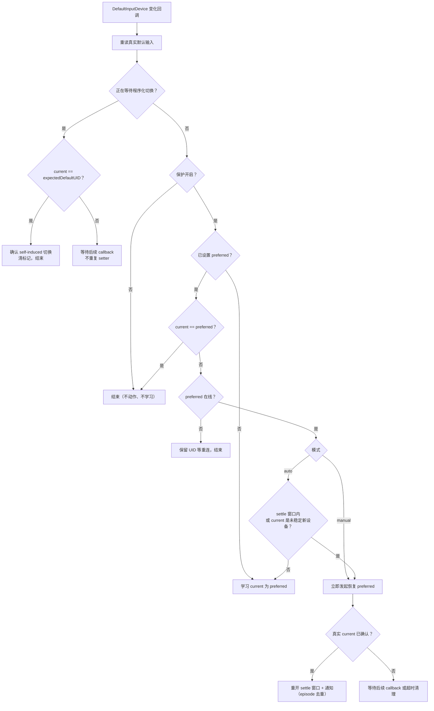
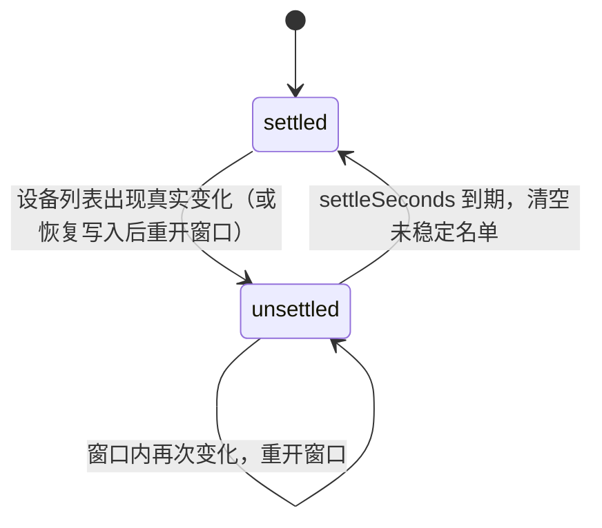
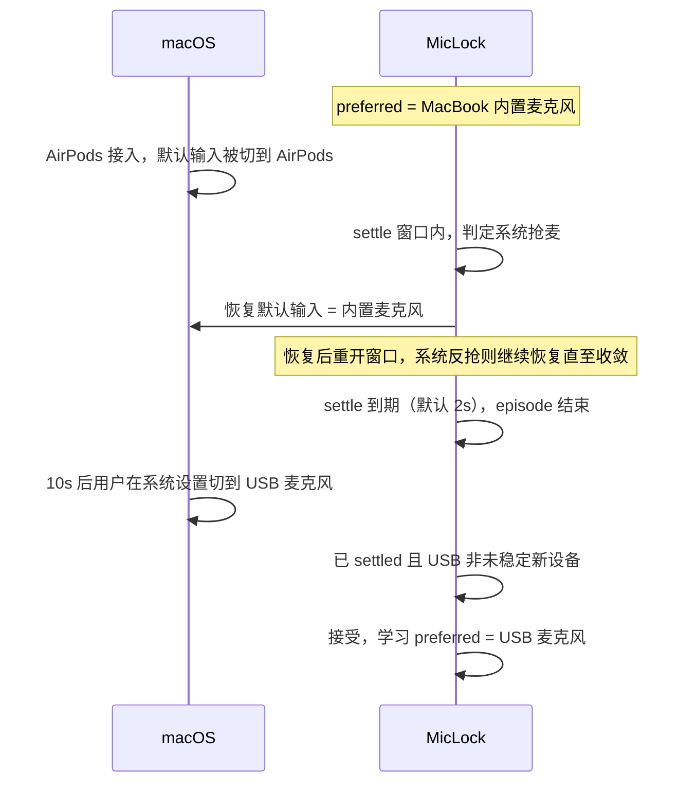

# Auto 模式原理

一句话：**恢复永远是立即的；settle 窗口只用来给变化定性**——判断默认输入的变化是「设备接入引起的系统抢麦」还是「用户主动切换」，而不是延迟任何动作。延迟恢复会让麦克风在几秒内真的落在错误的设备上，MicLock 不做这种折衷。

## Auto 与 Manual 的差异

| 场景 | Auto | Manual |
|---|---|---|
| 设备接入/断开的稳定窗口内的切换 | 立即恢复 | 立即恢复 |
| 窗口外的外部切换（系统设置、其他 App、CLI） | 接受，并学习为新的 preferred | 立即恢复 |
| 通知频率 | 一次拓扑变化最多一条 | 每次恢复一条 |
| preferred 何时变化 | 设备稳定后的外部切换 / MicLock 菜单选择 | 仅 MicLock 菜单选择 |
| 适合 | 日常使用：允许换麦，只防「被抢」 | 严格场景：默认输入永远锁定 |

## 判定流程

每次 `DefaultInputDevice` 变化回调（`handleDefaultInputChanged`）都按同一顺序判定：



几条分支的设计意图：

- **重读真实状态**：回调参数不可信，burst 中可能有重复/交错事件；每次从 CoreAudio 重读再判断，保证幂等
- **self-induced 优先**：MicLock 自己恢复引起的回调若不先吸收，会与外部事件混在一起造成 setter 循环
- **保护关闭时不学习**：避免关闭期间系统的临时选择悄悄改掉 preferred
- **preferred 离线不动**：系统 fallback 到什么设备都不跟，等重连（同 UID 复现）时才恢复

## settle 窗口与未稳定设备名单

Auto 判定用两个信号，缺一不可：

- **settle 窗口**：设备列表发生真实 delta 后的 `settleSeconds`（默认 2s，可调 1–30s）内，拓扑视为不稳定。计时用 `ContinuousClock` 单调时钟，不受系统时间修改影响。burst 中无 delta 的重复列表事件不重开窗口（幂等）
- **`unsettledNewUIDs`**：刚接入、尚未度过窗口的设备集合；settle 到期时清空



为什么需要两个条件：

- 只看窗口会漏一种情况：设备接入很久之后系统才把默认输入切过去（部分蓝牙栈/驱动行为），`isNew` 兜住它
- 只看 isNew 会误伤一种情况：设备稳定许久后用户主动切换到它，settle 到期把它移出名单后切换被正常接受

## 时序示例：AirPods 接入



同一过程的决策流（`MICLOCK_DEBUG=1` 输出）：

```text
t=0.0  DEVICE_LIST_CHANGED added={AirPods}
       unsettledNewUIDs={AirPods}，settle 窗口开启
t=0.2  DEFAULT_INPUT_CHANGED → AirPods
       settled=false → 立即恢复（AirPods → 内置麦克风），重开窗口
t=0.6  系统反抢 → AirPods
       仍在窗口内 → 再次恢复（同一 episode，不再发通知）
t=0.8  DEFAULT_INPUT_CHANGED → 内置麦克风
       命中 expectedDefaultUID，self-induced 回声，吸收
t=2.2  settleTask 到期 → 未稳定名单清空，episode 结束
t=10   用户在系统设置切换到 USB 麦克风
       settled=true 且 USB 非未稳定新设备 → 接受，学习
```

## 恢复后重开窗口

`restorePreferred` 成功后总是重开 settle 窗口：macOS 与蓝牙协议栈经常在被打回后立刻再抢一次；窗口内后续的每次变化都继续立即恢复，直到收敛。整个收敛过程共享一个 episode，最多一条通知。

## Trusted User Action

在 MicLock 菜单里选设备不受任何启发式限制（settle 窗口内也生效）：先尝试 setter，成功后才更新 preferred，并通过重新读取真实 current 或后续 listener callback 确认切换；setter 失败时保留旧 preferred。设备刚接入的 2 秒内想换首选，在 MicLock 里点即可，不会误触发保护。

## 已知限制

- **窗口内的外部切换会被恢复**：settle 窗口内用户在系统设置/其他 App 里切换输入设备，启发式无法与系统抢麦区分，会被恢复。窗口默认仅 2 秒；窗口内换首选请使用 MicLock 菜单（Trusted User Action）
- **个别虚拟驱动静默回弹**：极少数虚拟音频驱动会接受程序化 set 却在数百毫秒内静默回弹、且不产生属性事件。MicLock 无从感知这类回弹——UI 显示的「当前」可能与真实状态不符，但不会进入恢复循环
- **preferred 离线期间**：系统选了什么 fallback 设备 MicLock 都不动，仅等待同 UID 重连

## 对应单元测试

`Tests/AudioMonitorTests.swift` 中的映射：

| 测试 | 锁定的行为 |
|---|---|
| A1 new device hijack | 窗口内抢麦 → 立即恢复、preferred 不变、通知一条 |
| A2 settled user switch | 稳定后切换 → 接受并学习、不恢复、不通知 |
| A3 switch inside settle window | 窗口内切换 → 按启发式恢复（设计内限制） |
| A4 new device settles then accepted | 新设备稳定后用户切到它 → 接受（关键回归） |
| burst robustness | 反抢/重复/回声交错 → setter 不循环、一 episode 一条通知 |
| user selection inside settle window | Trusted User Action 立即生效且不被回声恢复 |
| user selection failure | setter 失败 → preferred 保持旧值并显示错误 |
| restore immediate confirmation | setter 立即反映 → 重读真实状态并发送通知 |
| restore waits for real confirmation | setter 延迟反映 → 确认前不伪造 current、不发送通知 |
| intermediate callback while expected | 中间 callback → 不重复 setter，最终真实确认只通知一次 |
| preferred reconnect already current | 重连时系统已恢复 preferred → 不重复 setter |
